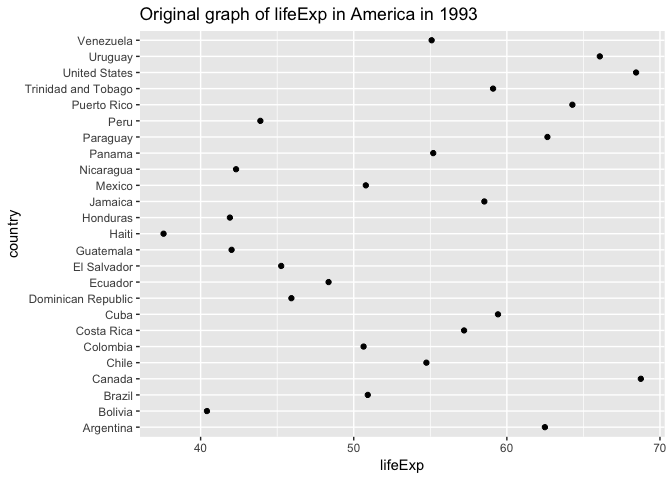

hw05-lh563
================
Lu Han
10/18/2018

### Part 1: Factor management

``` r
suppressPackageStartupMessages(library(tidyverse))
suppressPackageStartupMessages(library(forcats))
suppressPackageStartupMessages(library(gapminder))
```

Drop Oceania
------------

First, let's check what the dataframe looks like before and after the drop of Oceania.

``` r
gap_drop<-gapminder %>% 
  filter(continent!="Oceania") %>% 
  droplevels() %>% 
  str()
```

    ## Classes 'tbl_df', 'tbl' and 'data.frame':    1680 obs. of  6 variables:
    ##  $ country  : Factor w/ 140 levels "Afghanistan",..: 1 1 1 1 1 1 1 1 1 1 ...
    ##  $ continent: Factor w/ 4 levels "Africa","Americas",..: 3 3 3 3 3 3 3 3 3 3 ...
    ##  $ year     : int  1952 1957 1962 1967 1972 1977 1982 1987 1992 1997 ...
    ##  $ lifeExp  : num  28.8 30.3 32 34 36.1 ...
    ##  $ pop      : int  8425333 9240934 10267083 11537966 13079460 14880372 12881816 13867957 16317921 22227415 ...
    ##  $ gdpPercap: num  779 821 853 836 740 ...

``` r
summary(gap_drop)
```

    ## Length  Class   Mode 
    ##      0   NULL   NULL

``` r
gapminder %>% str()
```

    ## Classes 'tbl_df', 'tbl' and 'data.frame':    1704 obs. of  6 variables:
    ##  $ country  : Factor w/ 142 levels "Afghanistan",..: 1 1 1 1 1 1 1 1 1 1 ...
    ##  $ continent: Factor w/ 5 levels "Africa","Americas",..: 3 3 3 3 3 3 3 3 3 3 ...
    ##  $ year     : int  1952 1957 1962 1967 1972 1977 1982 1987 1992 1997 ...
    ##  $ lifeExp  : num  28.8 30.3 32 34 36.1 ...
    ##  $ pop      : int  8425333 9240934 10267083 11537966 13079460 14880372 12881816 13867957 16317921 22227415 ...
    ##  $ gdpPercap: num  779 821 853 836 740 ...

As we can see from the data, the continent now only have 4 factors instead of 5 in the original gapminder dataframe, also the observations reduced from 1704 in original dataframe to 1680. Because the "Oceania" level was dropped. We can double check with the "levels" function.

``` r
gap_drop$continent %>% 
  levels()
```

    ## NULL

Reorder the levels of countries
-------------------------------

``` r
gap_americas_1993 <- gapminder %>% 
  filter(year==1993,continent=="Americas")
ggplot(gap_americas_1993,aes(lifeExp,country)) +
  geom_point(color="country")+
  ggtitle("Original graph of lifeExp in America in 1993")
```


